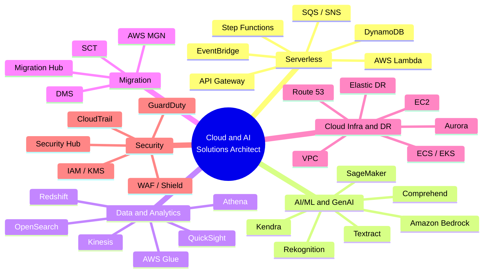
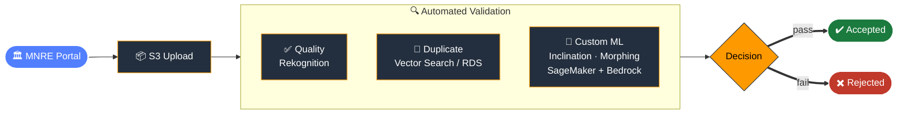
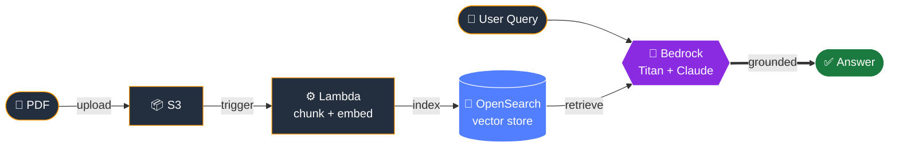

# Aditya Pandita

### Cloud & AI Solutions Architect

**Serverless SME | Data & AI | Migration & Modernization | 5x AWS Certified**

---

*Architecting the cloud infrastructure that powers nations.*

## About

Cloud Solutions Architect with 7+ years building enterprise-grade cloud infrastructure for government and public sector organizations across India. I specialize in designing serverless architectures, AI/ML platforms, data analytics pipelines, and end-to-end cloud migration strategies — delivering $5M+ annual revenue impact across 10+ government ministries and PSUs.

**Education:** IIT Roorkee (Machine Learning) | IIM Kozhikode (MBA) | University of Western Australia | Murdoch University

---

## Technical Expertise

**Multi-cloud & Tooling**

---

## Selected Projects

### 01 — National Smart Grid Infrastructure `Energy` `Enterprise`

Architected the cloud backbone for India's Advanced Metering Infrastructure (AMI) under PGCIL — enabling real-time monitoring, analytics, and management of **5M+ smart electricity meters** across the national grid.

```mermaid
flowchart LR
    M(["🔌 Smart Meters<br/>5M+ devices"]) ==>|telemetry| ING
    subgraph ING["🛡️ Ingest & Secure"]
        direction TB
        IOT["IoT Core"]
        AGW["API Gateway"]
        VPC["VPC + Security"]
    end
    ING ==>|stream| PROC
    subgraph PROC["⚙️ Process"]
        direction TB
        LAM["Lambda"]
        KIN["Kinesis"]
        SFN["Step Functions"]
    end
    PROC ==>|persist| STORE
    subgraph STORE["📊 Store & Visualize"]
        direction TB
        DDB["DynamoDB"]
        TS["Timestream"]
        QS["QuickSight"]
    end
    classDef meter fill:#1b7a3d,stroke:#fff,color:#fff,stroke-width:2px;
    classDef edge fill:#232F3E,stroke:#FF9900,color:#fff;
    classDef proc fill:#FF9900,stroke:#232F3E,color:#000;
    classDef data fill:#527FFF,stroke:#fff,color:#fff;
    class M meter;
    class IOT,AGW,VPC edge;
    class LAM,KIN,SFN proc;
    class DDB,TS,QS data;
```

| Metric | Value |
|--------|-------|
| Meters Managed | **5M+** |
| Cost Reduction | **42%** |
| Uptime SLA | **99.9%** |

---

### 02 — MNRE Solar Rooftop AI Analysis `AI/ML` `Government`

Built a multi-stage AI image validation pipeline for India's rooftop solar subsidy program. Images submitted for subsidy claims pass through three automated checks:

> **Services:** Step Functions, Rekognition, SageMaker AI, Bedrock, RDS (pgvector), S3, Lambda

---

### 03 — Polaris — Energy Theft & Load Forecasting `AI/ML` `Energy`

ML use cases for power utilities — anomaly-based theft detection to identify tampered meters and unauthorized consumption, and demand forecasting for capacity planning across distribution networks.

| Use Case | Approach |
|----------|----------|
| Theft Detection | Anomaly models on meter reading patterns |
| Load Forecasting | Time-series prediction for grid demand |

---

### 04 — AI Insights — DISCOM Capacity Planning `GenAI` `Open Source`

End-to-end AI-powered capacity planning for power distribution companies analyzing four growth vectors across **411K+ records** and **11 cities**.

```mermaid
flowchart LR
    subgraph SRC["📊 Data — 411K+ records"]
        direction TB
        DT["DT Meters"]
        EV["EV Charging"]
        SO["Solar"]
        BE["BESS"]
    end
    SRC ==>|ingest| FN
    subgraph FN["⚙️ 5x Lambda Functions"]
        direction TB
        F1["DT Forecast"]
        F2["EV"]
        F3["Solar"]
        F4["Capacity"]
        F5["Chat Orchestrator"]
    end
    FN ==>|serve| UI
    subgraph UI["🖥️ Experience Layer"]
        direction TB
        R["React Dashboard<br/>Chart.js KPIs"]
        C["Multi-Agent AI Chat<br/>Bedrock Claude"]
    end
    classDef src fill:#527FFF,stroke:#fff,color:#fff;
    classDef fn fill:#FF9900,stroke:#232F3E,color:#000;
    classDef ui fill:#232F3E,stroke:#FF9900,color:#fff;
    class DT,EV,SO,BE src;
    class F1,F2,F3,F4,F5 fn;
    class R,C ui;
```

> **Stack:** Lambda, DynamoDB, Bedrock (Claude), API Gateway, React, Chart.js, CloudFormation

---

### 05 — Power Utilities Visualization Pipeline `Data & Analytics` `Open Source`

Automated IaC solution — CloudFormation deploys an end-to-end ETL pipeline analyzing interval meter readings at 15-minute granularity.

> **Stack:** CloudFormation (24 resources), S3, Lambda, Redshift, QuickSight, VPC, IAM

---

### 06 — Serverless RAG — Chat with PDF `GenAI` `Serverless`

Fully serverless Retrieval Augmented Generation system — upload a PDF, ask questions in plain English, get answers grounded in the actual document with zero hallucinations.

> **Stack:** S3, Lambda, Bedrock (Titan + Claude 3 Haiku), OpenSearch Serverless, API Gateway, CDK

---

### 07 — IPv6 Smart Meter Migration `Networking` `Published`

Designed the IPv6 migration strategy for IoT-scale smart meter networks — solving address exhaustion for millions of connected devices. **Published on the AWS Industries Blog.**

---

### 08 — Enterprise Cloud Migration — NRL `Migration` `Enterprise`

End-to-end migration of Nurmaligarh Refinery's VMware infrastructure to AWS — modernizing legacy workloads using MGN and DMS, with DR strategies achieving lowest RPO/RTO targets.

---

### 09 — Serverless Computer Vision `Serverless` `Published`

End-to-end serverless image analysis using Lambda, Rekognition, and API Gateway. **Published on AWS Serverless Land.**

---

## Certifications

-8A2BE2?style=for-the-badge&logo=amazon&logoColor=white)

*Plus AWS Support Engineering awards, Serverless Demonstrated, Digital Sovereignty (Technical), Migration Acceleration Authorized, and 25+ AWS technical & partner training badges.*

---

## Recognition

| Award | Details |
|-------|---------|
| "All Rounder" Award | 2 consecutive quarters |
| Rising Star Award | — |
| Bolster Award | — |
| Most Valuable Player (MVP) | 3x — AWS Support Engineering |
| AWS TFC Gold Member | Serverless & GenAI/ML Communities |

---

## Key Impact

| $5M+ | 10+ | 5M+ | 42% |
|:---:|:---:|:---:|:---:|
| Annual Revenue | Govt Ministries & PSUs | Smart Meters Managed | Cost Reduction |

---

## GitHub Stats

---

## Notable Clients & Partners

PGCIL · MNRE · PMSG Portal · Bureau of Energy Efficiency · DGH · RECL · NBFC · Nurmaligarh Refinery · GRID India · Polaris-Intellismart · EPFO · GSTN · Accenture · Deloitte · PwC · CMS · CT · BCG

---

**[adityapandita.com](https://adityapandita.com)**

*Built with HTML5, CSS3, and vanilla JavaScript. No frameworks, no dependencies.*

